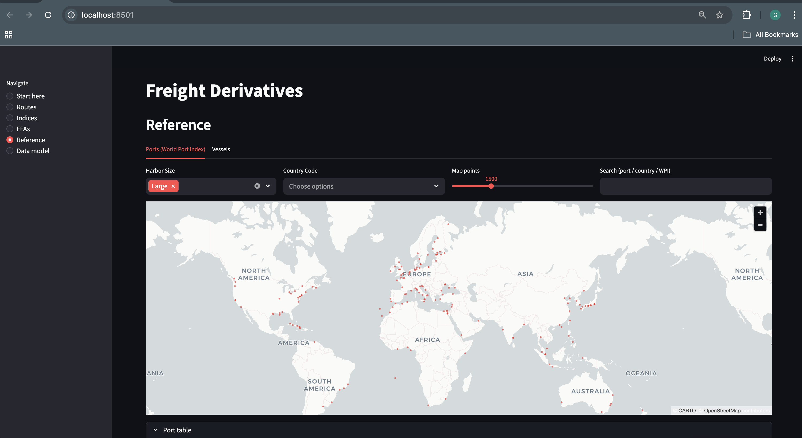
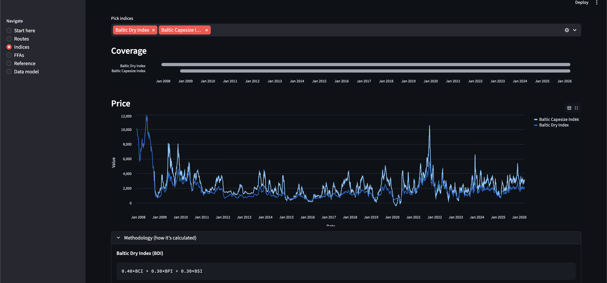

# Freight Derivatives (Beginner App)

This repo is a small, beginner-friendly Streamlit app for understanding **freight routes**, **indices**, and **freight derivatives (FFAs/options)** using Baltic-style reference data.

## What’s in here

- `streamlit/app.py` — the Streamlit UI.
- `streamlit/dataframes.py` — dataframe loaders (JSON index time series + CSV reference tables).
- `datasets/` — local datasets used by the app (indices, routes, vessels, ports, FFA instruments, etc.).
- `data_model/` — a generated “dbdiagram-style” ERD rendered with Mermaid.

## Run the app

From the repo root:

```bash
streamlit run streamlit/app.py
```





The app expects the datasets under `datasets/` to exist and be readable.

## Data model (Mermaid → single HTML)

Generate the HTML ERD:

```bash
python3 data_model/generate.py
```

Outputs:
- `data_model/erd.html` — opens in any browser (pan/zoom + expandable column lists).
- `data_model/erd.mmd` — Mermaid source (full schemas).

The Streamlit “Data model” page will auto-generate `data_model/erd.html` if it’s missing.

## Notes

- This is educational software, not trading advice.
- The datasets may mix “reference truth” with “best-effort mappings” (e.g. mapping routes to ports by name).

